# Xcode7.1 菜单选项

标签（空格分隔）： iOS Xcode

---

下面划了删除线的选项是太基础的选项可以忽略，`加粗的选项是需要注意的`。

| File: |     |
| -------- | ----- |
| New : 可以新建tap,窗口，新文件，playground，workspace，target等等。    Add Files to XX: 为这个项目中引入文件    ~~Open ：打开文件~~    Open Recent  ：打开最近的打开的项目或者工作组    Open Quickly  ：通过搜索文件名快速打开一个文件    Close ：这几个选项的都是关闭操作。    ~~Save ：保存~~    ~~Duplicate：复制~~    **Revert  to Saved：将此文件的修改直接回退到上次保存时**    Unlock ：要对第三方库或系统文件进行修改时解锁    ~~Show in Finder ：在Finder 中展示~~    Open with External Editor  ：使用外部编辑器打开    Save As Workspace： 另存为工作组    Page Setup ：页面设置，为打印而生    Print… ：用打印机打印当前文件 | 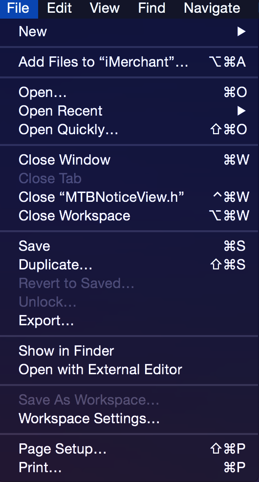 |

| Edit: |     |
| -------- | ----- |
| Undo: 撤销    Redo ：反撤销    ~~Cut ：剪切~~    ~~Copy ：拷贝~~    ~~Paste ：粘贴~~    Special Paste ：特殊粘贴 ??    Paste and Preserve formatter ：粘贴并匹配样式    ~~Duplicate :复制~~    ~~Delete :删除~~    ~~Select All :全选~~    Filter : 筛选，可以选择在导航栏中筛选和在库中筛选    Sort：排序 (还不知道怎么用)    Format ：格式    Font ：可以打开字体和颜色的设置框，可以copy样式。    Text ：可以设置编码的页面左右对齐，**显示顶部标尺**。    Spelling and Grammar ：拼写提示和语法提示。    Substitutions：会出来个仪表盘，提供微操。    **Transformations ：可以将英文转成全大写，全小写，首字母大写。**    Speech ：开始说话结束说话。    Refactor: 重构    Rename 重命名    Extract 提取    Create Superclass  创建超类    Move Up 上移    Move Down 下移    Convert：转换成ARC,swift等    Encapsulate 封装    Start Dictation: 开始听写    **Emoji & symbols：emoji表情和特殊符号** | 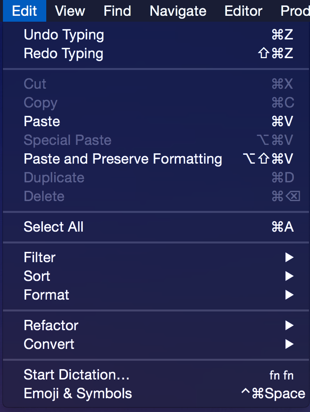 |

| View: |     |
| -------- | ----- |
| Standard Editor ：标准模块    Assistant Editor ：助理模块    Version Editor： 版本模块    Navigators：里面包含了xcode左边8个导航模块的切换。    Debug Area：中下部的调试框和打印输出框。    Untilities: xcode右边的上面两个选项和下面的四个选项。    Show File Inspector：显示文件检查    Show Quick Help Inspector：显示快速帮助    File Template Library  文件模板库    Code Snippet Library  代码片段库    Object Library  对象库    Media Library  媒体库    Hide Utilities  隐藏实体工具    **Hide Toolbar  隐藏工具栏（XCode顶部）**    **Hide Tab Bar  隐藏标签栏（用了cmd+T出来的tab切换）**    ~~Enter Full Screen：全屏~~ | 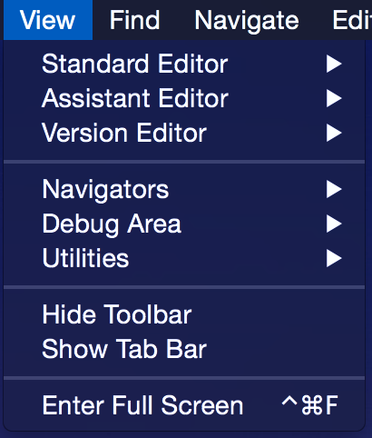 |

| Find: |     |
| -------- | ----- |
| Find in Workspace… 在工作组中查找    Find and Replace in Workspace… 在工作组中查找和替换    …    上面4个是在哪地方查找或替换，中间4个是在你几个选中的文件或组中查找，    再下面4个是查找或替换，然后是替换。    **Find Call Hierarchy：查找到调用层级。**    Hide Find Bar：隐藏查找栏    Use Selection for Find ：使用选择的地方去查找    Use Selection for Replace：使用选择的地方去替换 | 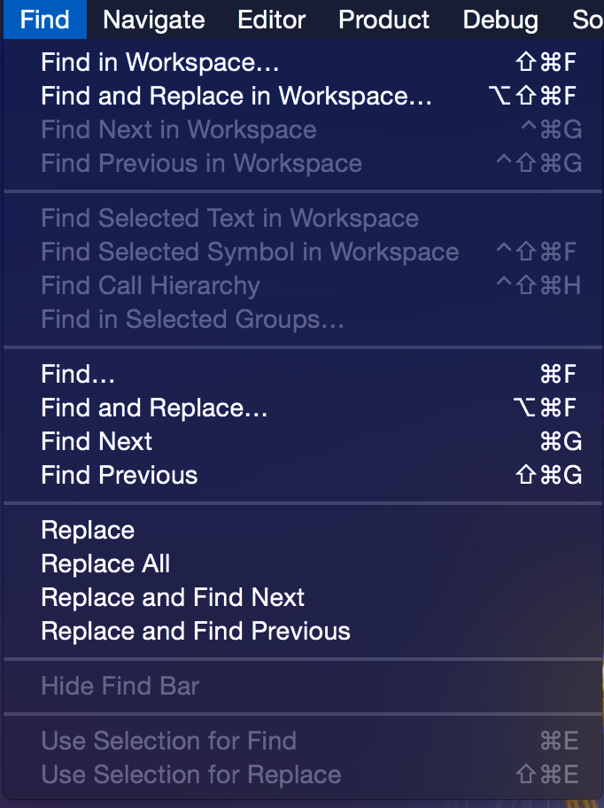 |

| Navigate: |     |
| -------- | ----- |
| **Reveal in Project Navigator ：在项目导航中揭示出此文件**    Reveal in Symbol Navigator  ：在符号导航中揭示出某方法    Open in Assistant Editor：用分屏助理打开    **Open in ..   你想怎么打开**    Move Focus To Next Area  将焦点移动到下一个区域    Move Focus To Editor   将焦点移动到编辑器    Go Forward  前进，相当于两个手指左划右划    Go back  后退    Jump to Selection 跳转到选择    Jump to Definition 跳转到定义    Jump to OriginalSource 跳到源文件    Jump to Next Issue  跳转到下一个问题    Jump to Previous Issue  跳转到上一个问题    Jump to Next Counterpart  ：??    Jump to Previous Counterpart : ??    Jump to Line in xxx.m ：跳到这个文件的第几行。    Jump to Next Placeholder ：??    Jump to Previous Placeholder：?? | 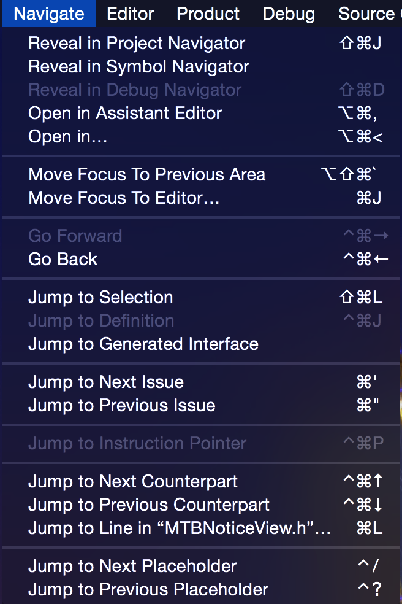 |

| Editor:(选中文件状态下): |     |
| -------- | ----- |
| Show Completions : 显示自动补全    Edit All in Scope: 在当前文件全文修改选中的一个变量或单词    **Fix All in Scope: 在当前文件自动处理他能解决的error，相当于点**    **Show issue: 展示错误和隐藏错误，相当于点左边的按钮**    Issues: 可以控制展示全部错误警告，还是仅仅展示警告。    Structure: 构造    Balance Delimiter：直接选中光标所在的整个大括号    **Re-Indent : 将格式缩进整理一下**    这里还有四个，分别是往前或往后移一个tab，往上往下移一行    Code Folding: 提供各种折叠和取消折叠    **Focus Follow Selection：高亮聚焦你光标所在的模块**    Syntax Coloring: 设置各个语法的高亮配色    **Show Invisibles: 显示所有隐藏的东西，比如空格。**    Show Blame for Line: 显示选中的行的修改者和log。    Show Code Coverage: 展示代码的覆盖范围 | 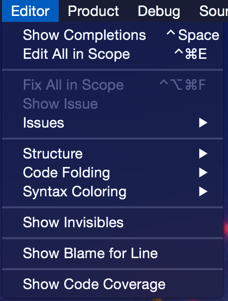 |

| Editor:(选中xib状态下): |     |
| -------- | ----- |
| Canvas 画布    **Show Selection Highlights: 显示选中控件的高亮**    Show Resize Knobs：显示约束旁边的小方块    Show Constraints ：显示约束    **Show Involved Views For Selected Constraints：显示约束涉及到的视图**    **Show Layout Rectangles  布局矩形**    Size Class: 屏幕布局相关，相当于点xib下面的按钮    Show Bounds Rectangles  显示边界矩形    Hide Document Outline：隐藏或显示左边的层级图    Reveal in Document Outline：在左边的层级图中揭示出来    Align  对准    ~~Align Left Edges  左边缘对齐~~    ~~Align Right Edges  右边缘对齐~~    ~~Align Top Edges  顶部边缘对齐~~    ~~Align Bottom Edges  底部边缘对齐~~    ~~Align Horizontal Centers  横向中心对齐~~    ~~Align Vertical Centers  竖向中心对齐~~    Align Baselines  基线对齐    Align Horizontal Center In Container   对齐容器中的水平中心    Align Vertical Center In Container   对齐容器中的垂直中心    Arrange : 可以上移下移或移到背景等    Embed ： 嵌入，可以嵌nav，tabbar，scrollView    Unembed   解除嵌入    Size to Fit ：大小以适合    **Snap to Guides：让引导线具有吸附功能，让控件靠近就自动对齐**    Guides：设置引导标尺线    Add Horizontal Guide ： 添加横向标尺线    Add Vertical Guide ： 添加垂直标尺线    Automatically Refresh Views：自动刷新视图    Refresh All Views：刷新所有视图    Debug Selected Views：调试选中的视图？    Resolve Auto Layout issues：解决自动布局的问题，类似于点    Refactor to Storyboard：把VC重构成SB？ | 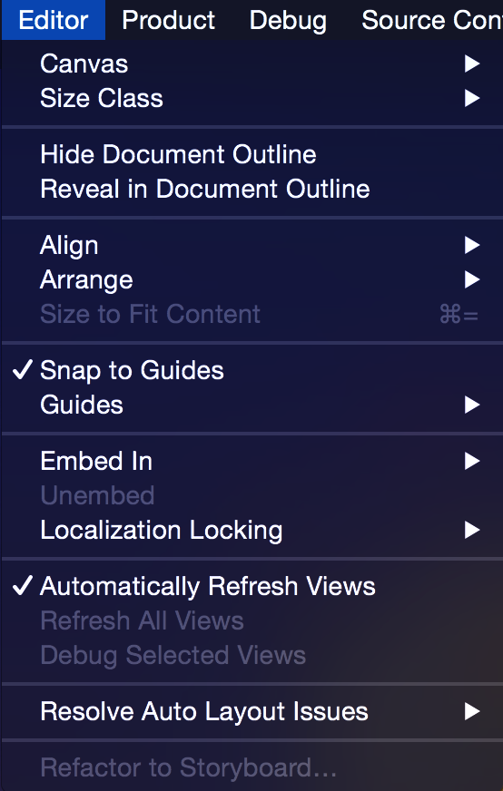 |

| Product: |     |
| -------- | ----- |
| ~~Run：运行~~    Test：??    Profile：打开instrument之类的    **Analyze：进行代码分析，可以检测一些不规范的OC语法**    Archive：归档    Build for：和上面的功能相似。    Perform Action：??    ~~Build：编译~~    ~~Clean：清一下之前编译的缓存~~    ~~Stop：停止~~ | 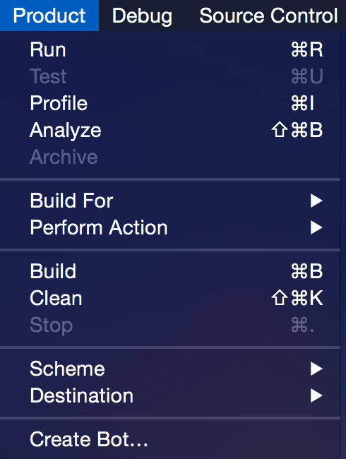 |

| Debug: |     |
| -------- | ----- |
| Pause : 暂停 会 切换成继续    **Continue to Current Line：走到你光标选中的这行**    Step Over ： 跨越    Step Into ：步入    Step Out ：走出    Step Over Instruction： 跨过指示    Step Over Thread ：单步执行在线程    Step Into Instruction ：步入指示    Step Into Thread ：单步执行线程    Capture GPU Frame: 捕获GPU位置    Simulate Location: 模拟模拟器的位置    Simulate Background Fetch: 让模拟器去后台    iCloud: 苹果云相关    View Debugging: 关于视图的调试    Take Screenshot of Active Device：截图    **Capture View Hierarchy: 用3D图 来捕获视图层次**    **Show View Frame: 在模拟器上显示各个控件的尺寸大小**    Show Alignment Rectangles: 显示对齐矩形    Show View Drawing: 显示查看绘图    Show Responsive Scrolling Status: 显示响应滚动状态    Deactivate Breakpoints  停用中断点。    Breakpoints: 相当于左下角的加号，增加各种断点。    Debug Workflow：可以显示内存和清除打印等操作。    Always Show Disassembly: 这要是勾上就只显示堆栈信息不看代码    Attach to Process by PID or Name: 设置权限id或name    Attach to Progress: 附加到进程    Detach: 跳过所有的断点 | 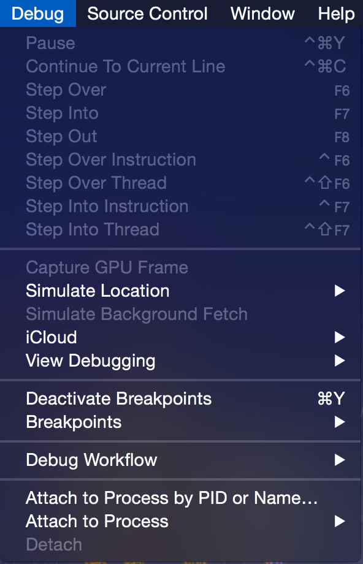 |

| Source Control: |     |
| -------- | ----- |
| 第一行是分支管理，可以创建分支合并分支，配置分支的源等等。    **Create Working Copy：项目中如果有地方是引用的那就copy一下。**    Checkout：可以选择切换分支。    ~~Commit  ：提交~~    ~~Push ： 上传代码~~    ~~Pull ：拉代码~~    Refresh Status：刷新状态    **Discard Changes ：放弃所有修改。**    **Add Selected Files : 将选中的这些问号文件add一下。**    **Discard Changes  in selected Files : 将选中的这些文件放弃修改。**    Mark Selected  Files as Resolved: 相当于合并或rebase过程中的解决。    History：可以看当前分支的log历史。 | 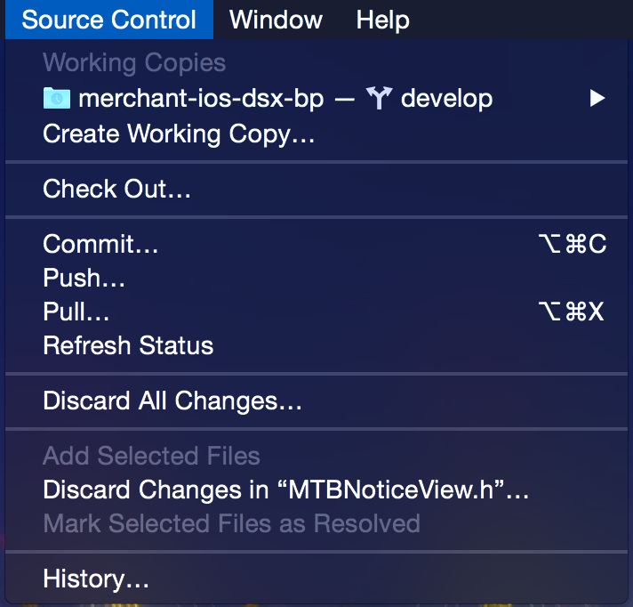 |

| Window: |     |
| -------- | ----- |
| Minimize: 最小化    Zoom：相当于windows的“还原”    Show next tab: 如果你有两个tab的话这个就是切换tab    Show previous tab: 同上    Documentation and API Reference：打开xcode文档    welcome to xcode: 来到开始页面    Device：硬件，能看到MAC ，模拟器和手机    Organizer：打开可以看到Archives 和 Crashes    **Project：查看最近项目，也可以在这里删除Derived Data**    **Bring all to Front：把所有xcode打开的都置顶。** | 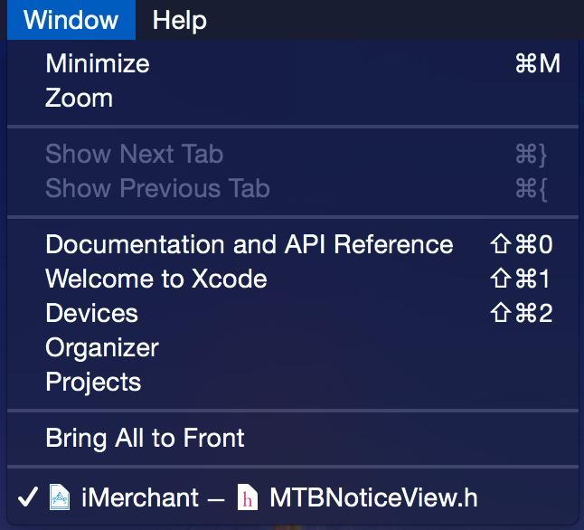 |

| Help: |     |
| -------- | ----- |
| Search : 在目录中搜索功能。    Documentation and API Reference：打开xcode文档    Xcode OverView：打开xcode综述    Release Notes：打开xcode各版本更新迭代的log。    What’s New in Xcode：有什么新特性    Quick help for selected Item：快速帮助，相当于按着option点。    **Search Documentation for Selected  Text：详细帮助，直接在文档里找到这个。** | 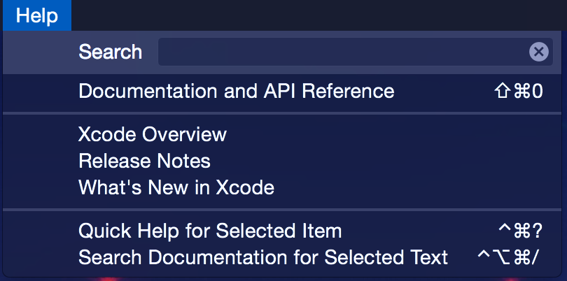 |
